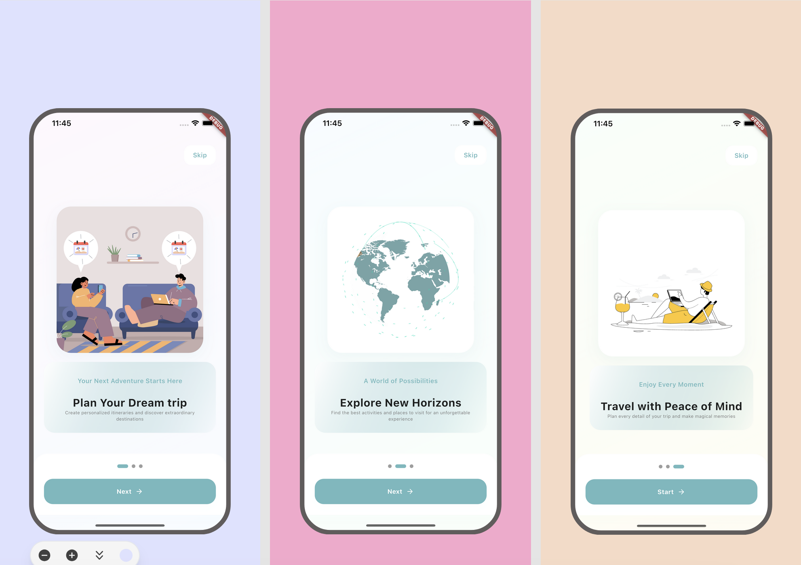
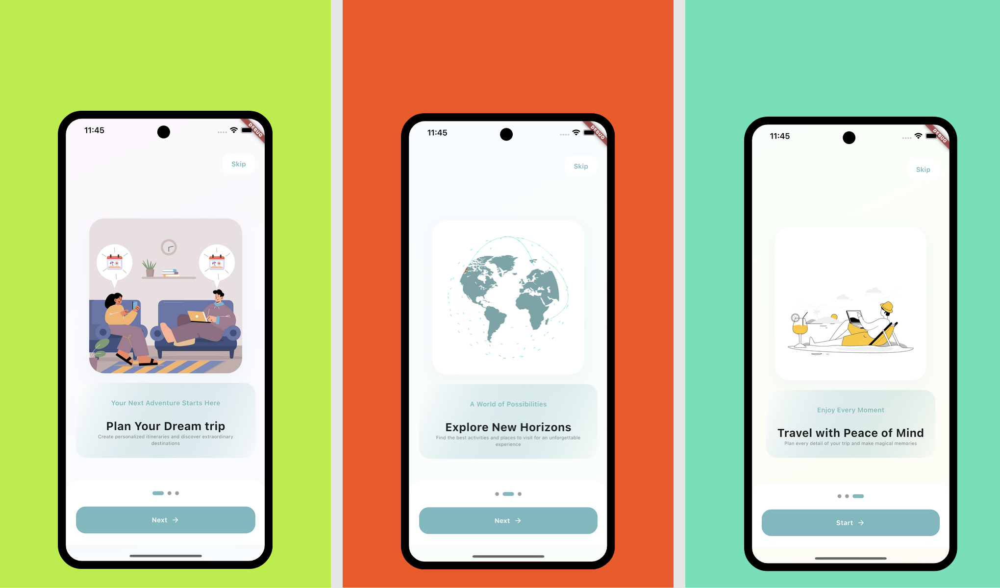

<!--
This README describes the package. If you publish this package to pub.dev,
this README's contents appear on the landing page for your package.

For information about how to write a good package README, see the guide for
[writing package pages](https://dart.dev/guides/libraries/writing-package-pages).

For general information about developing packages, see the Dart guide for
[creating packages](https://dart.dev/guides/libraries/create-library-packages)
and the Flutter guide for
[developing packages and plugins](https://flutter.dev/developing-packages).
-->

## Lottie Onboarding Screen

This Flutter package allows you to add an interactive and animated onboarding screen to your application, using Lottie for smooth and engaging animations. It is fully customizable and easy to integrate.

## Created by [@badiniibrahim](https://github.com/badiniibrahim)

Liked some of my work? Buy me a coffee. Thanks for your support :heart:

<a href="https://buymeacoffee.com/toncopilote" target="_blank"></a>

## Screenshot

- IOS
  

- Android
  

## Features

- Lottie animations for a better user experience
- Smooth navigation with page control and indicators
- Advanced customization for colors, fonts, and styles
- Animated transitions between pages.
- Skip and Finish actions management for optimized navigation

## Getting Started

Add the dependency to your `pubspec.yaml` file:

```yaml
dependencies:
  ...
  lottie_onboarding_screen: latest_version
```

## Here's a complete example showcasing the usage of the Onboarding Screen:

```dart
void main() {
  runApp(const MyApp());
}

class MyApp extends StatelessWidget {
  const MyApp({super.key});

  @override
  Widget build(BuildContext context) {
    return GetMaterialApp(
        home: LottieOnboardingScreen(
      pages: [
        {
          'title': 'Plan Your Dream trip',
          'subtitle': 'Your Next Adventure Starts Here',
          'description':
              'Create personalized itineraries and discover extraordinary destinations',
          'animation': 'assets/animations/travel_planning.json',
          'gradient': [Color(0xFFF8BDEB), Color(0xFFB4E4FF)],
        },
        {
          'title': 'Explore New Horizons',
          'subtitle': 'A World of Possibilities',
          'description':
              'Find the best activities and places to visit for an unforgettable experience',
          'animation': 'assets/animations/world_exploration.json',
          'gradient': [Color(0xFFB4E4FF), Color(0xFFBBF7D0)],
        },
        {
          'title': 'Travel with Peace of Mind',
          'subtitle': 'Enjoy Every Moment',
          'description':
              'Plan every detail of your trip and make magical memories',
          'animation': 'assets/animations/travel_relax.json',
          'gradient': [Color(0xFFBBF7D0), Color(0xFFFDE68A)],
        },
      ],
      onSkip: () {},
      onFinish: () {},
      indicatorActiveColor: Color(0xFF70B9BE),
      indicatorInactiveColor: Colors.grey,
      skipText: "Skip",
      nextText: "Next",
      startText: "Start",
      skipTextStyle: const TextStyle(
          fontSize: 14, fontWeight: FontWeight.w600, color: Color(0xFF70B9BE)),
      buttonBackgroundColor: Color(0xFF70B9BE),
      buttonBoxShadow: [
        BoxShadow(
          color: Color(0xFF70B9BE).withAlpha(3),
          blurRadius: 20,
          offset: const Offset(0, 10),
        ),
      ],
      fontFamily: 'Gilroy',
    ));
  }
}

```

### Parameters

- **`pages`**: (required) - A list of pages with animations, titles, and descriptions.
- **`onSkip`**: (required) Function() - Callback when the skip button is pressed.
- **`onFinish`**: (required) Function() - Callback when the onboarding process is completed.
- **`indicatorActiveColor`**:Color - The color of the selected page indicator. Default is Color(0xFF70B9BE).
- **`indicatorInactiveColor`**:Color - The color of the unselected page indicators. Default is Colors.grey.
- **`skipText`**:String - The text for the skip button. Default is "Skip".
- **`nextText`**: String - The text for the next button. Default is "Next".
- **`startText`**: String - The text for the get started button. Default is "Start".
- **`fontFamily`**: String - Custom font family. Default is "Arial".

## LinkedIn

Connect with me on [LinkedIn](https://www.linkedin.com/in/badini-ibrahim-sawadogo-306b119b/)
